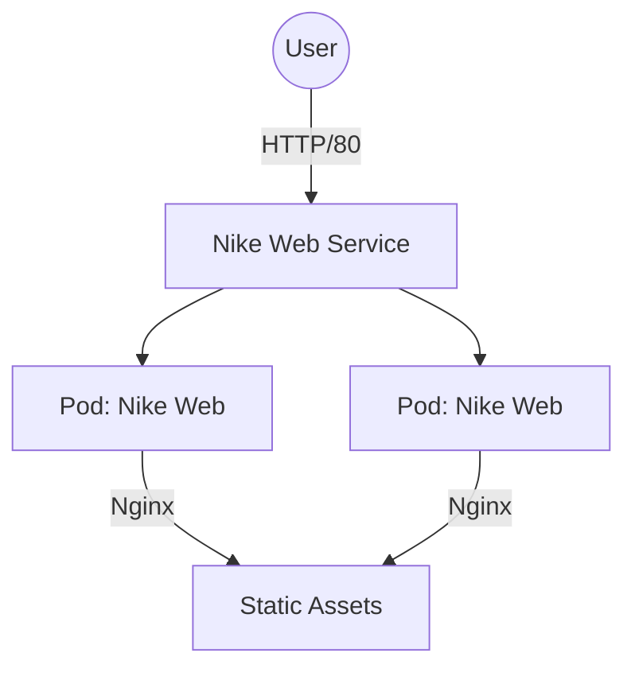
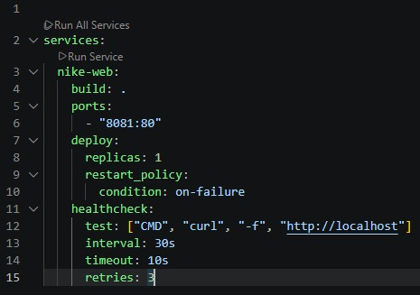
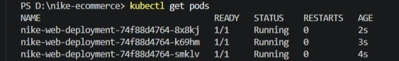
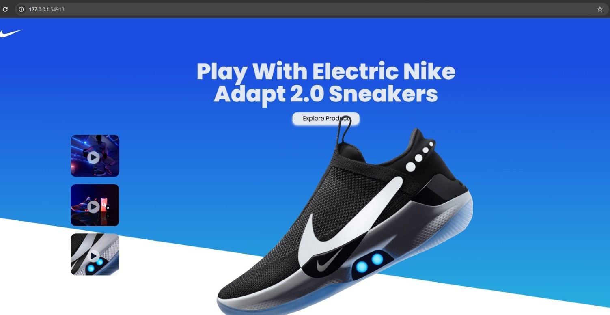

<h1 align="center"> Nike E-commerce </h1>

<h2 align="center"> Welcome to my E-commerce Clone </h2>

 

<h4 align="center"> 
Hi, I'm Leandro. This project is a full-featured E-commerce clone built with Vite and TailwindCSS, incorporating modern tools such as Redux Toolkit and React Toast.
</h4>

  <a href="https://nike-ecommerce-tau.vercel.app/"><strong>:point_right: Live Demo: Nike Shop</strong></a>

---

# Nike E-commerce: Infrastructure Lifecycle Lab

## Project Overview
This repository documents the end-to-end infrastructure evolution of a React-based E-commerce application. We transitioned from a standard local development environment to a containerized architecture (**Docker Swarm**) and finally to a production-grade orchestrator (**Kubernetes**).

---
## 🏗️ Architecture

---

## 🛠️ Technology Stack
* **Docker Desktop**: The virtualization engine used to manage container runtimes and simulate local environments.
* **Docker Swarm**: A native Docker tool used for container orchestration and service management.
* **Minikube**: A tool that runs a local Kubernetes cluster, simulating a cloud-based server environment.
* **kubectl**: The official command-line interface used to manage, inspect, and communicate with the Kubernetes API.

---

## 🏗️ Infrastructure Lifecycle

### Phase 1: Containerization & Docker Swarm Orchestration
1. **Repository Setup**: Cloned the source application and established the container boundary using a custom `Dockerfile` (optimized with Nginx for static serving).
2. **Local Orchestration**: Implemented `docker-compose.yml` to define service network, replicas, and local volume configurations for Docker Swarm compatibility.
3. **Swarm Validation**: Initialized Swarm mode to validate service scaling and load balancing basics in a local environment.

<em>Figure 1: Service definition, replicas, and healthchecks in docker-compose.yml.</em>

### Phase 2: Migration to Kubernetes (k8s)
1. **Manifest Architecture**: Decoupled service configuration into declarative YAML files stored in `/k8s`.
    * `deployment.yaml`: Defines the desired state, including pod replicas, image pull policies, and resource health checks.
    * `service.yaml`: Configures network abstraction to expose the application fleet.
2. **Cluster Orchestration**: Deployed the stack to a **Minikube** cluster, ensuring state management and service discovery.

<em>Figure 2: Verification of running pods within the Minikube cluster.</em>

 

  

  <em>Figure 3: Nike E-commerce application successfully deployed and running in the browser.</em>

---

## 🚀 Deployment Guide (Step-by-Step)

### Prerequisites
Ensure the following tools are installed:
* [Docker Desktop](https://www.docker.com/products/docker-desktop/)
* [Minikube](https://minikube.sigs.k8s.io/docs/start/)
* [kubectl](https://kubernetes.io/docs/tasks/tools/)

### Workflow
1. **Start Cluster**: `minikube start`
2. **Configure Terminal Bridge**: `minikube -p minikube docker-env --shell powershell | Invoke-Expression`
3. **Build Container Image**: `docker build -t nike-web:latest .`
4. **Deploy Manifests**: `kubectl apply -f k8s/`
5. **Verify Readiness**: `kubectl get pods`
6. **Access App**: `minikube service nike-web-service`
7. **Teardown**: `minikube stop`

---

### 💡 Troubleshooting & Best Practices

* **Ensure Docker is Running**: Before initiating `minikube start`, confirm that Docker Desktop is fully initialized and the daemon is active.
* **PowerShell Permissions**: If the `docker-env` command fails due to execution policy, run your terminal as Administrator or execute `Set-ExecutionPolicy RemoteSigned` in your PowerShell session.
* **Resource Allocation**: Minikube consumes system resources. If your PC performance drops, ensure you have allocated enough RAM/CPU in Docker Desktop settings.
